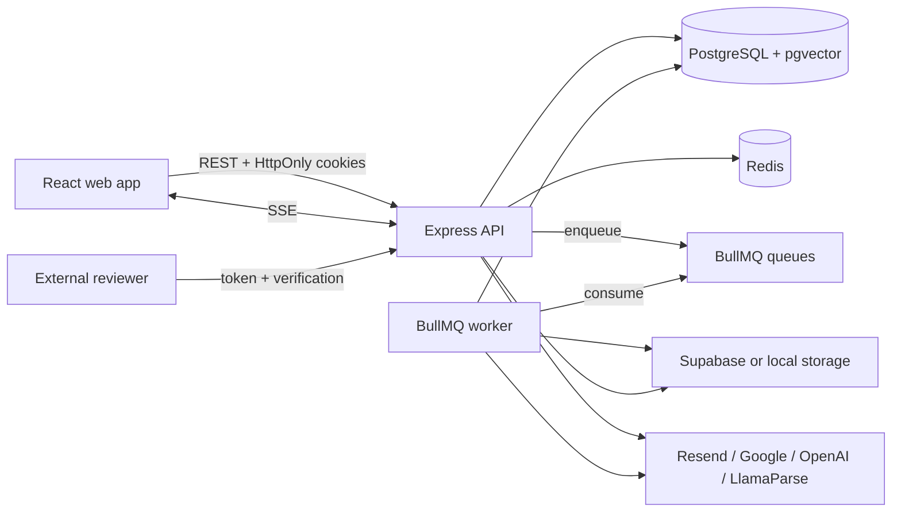

# Raise architecture

This document describes the architecture implemented in this repository. It
is the technical source of truth for contributors; update it when a change
alters a system boundary, major data flow, security rule, or runtime component.

For installation and commands, start with the [root README](../README.md).

## System context

Raise is a multi-tenant fundraising platform. A user can belong to multiple
startup workspaces, and almost all business data belongs to exactly one
startup. The founder application and the external reviewer portal share one
API but have separate authentication and authorization paths.



## Runtime components

| Component | Entry point | Responsibility |
|---|---|---|
| Web app | `packages/web/src/main.tsx` | Founder UI and reviewer UI |
| API | `packages/api/server.ts` | REST, authentication, SSE, cron scheduling, health/readiness |
| Worker | `packages/api/src/jobs/workers/index.ts` | Durable asynchronous processing |
| PostgreSQL | `packages/api/prisma/schema.prisma` | Transactional data, audit history, document metadata/chunks, vectors |
| Redis | `packages/api/src/db/redis.ts` | BullMQ, distributed rate limits, cron locks, realtime Pub/Sub |

The API and worker are separate processes. The API may enqueue work, but it
does not run BullMQ processors. Cron schedules run inside each API replica and
use Redis locks so only one replica performs a logical tick.

## Monorepo boundaries

The repository has two npm workspaces:

- `@raise/web` is the React/Vite frontend.
- `@raise/api` contains the Express API, Prisma access, cron jobs, and workers.

Turborepo coordinates root `dev`, `build`, `test`, and `lint` commands. There
is currently no shared package. API-facing frontend types are generated from
OpenAPI rather than imported from backend source.

## Frontend architecture

### Composition and routing

`main.tsx` creates the TanStack Query client. `App.tsx` installs the browser
router, authentication provider, route tree, and toast host. Route modules are
lazy-loaded from `packages/web/src/routes/index.tsx`.

The route boundaries are:

1. Public marketing and reviewer routes.
2. Public authentication routes under the authentication layout.
3. Founder routes guarded by `ProtectedRoute`.
4. Startup-dependent routes additionally guarded by `RequireWorkspace`.

`ProtectedRoute` establishes only that a user is signed in. It does not grant
workspace access. `RequireWorkspace` ensures a usable active workspace exists;
the API remains authoritative for membership and permissions on every request.

### State ownership

| State | Owner | Examples |
|---|---|---|
| Server state | TanStack Query | investors, pipeline, documents, chat, notifications |
| Durable UI preferences | Zustand with local storage | preferred startup, active round, chart range |
| Authentication | `AuthProvider` | current user and session bootstrap |
| Route state | React Router | selected deep-linked deal/conversation |
| Ephemeral component state | React | dialogs, forms, selection, drag state |
| Chat drafts | session storage | per-startup, per-conversation/thread draft and nonce |

The Zustand store is a preference cache, never an authorization source. Query
keys in `packages/web/src/lib/query-keys.ts` must include the startup and other
resource scope necessary to prevent cross-workspace cache reuse.

### API and session behavior

`packages/web/src/lib/api-client.ts` creates the Axios client at `/api/v1` with
credentials enabled. A 401 triggers one shared refresh request and retries the
original request. Browser Locks serialize refreshes across tabs when supported.

The Vite development server proxies `/api` to port 3000. Production should
preserve the same-origin arrangement or provide an equivalent secure cookie
and CORS configuration.

### Realtime behavior

`useNotificationStream` opens one authenticated `EventSource` for both
notifications and team chat. Redis Pub/Sub fans events out across API replicas.
Events are invalidation signals, not the system of record: the client refetches
PostgreSQL-backed queries after each event and on stream reconnection. This
makes missed or duplicate Pub/Sub messages recoverable.

Chat sends are optimistic. Client-only delivery state is stored in the query
cache, failed messages remain retryable, and the same `clientNonce` is reused
so the backend idempotency constraint prevents duplicates.

## Backend architecture

### Request and authorization path

A typical startup-scoped request follows this sequence:

```text
route -> authenticate -> validate params -> requireMember
      -> requirePermission -> validate payload -> controller -> service -> Prisma
```

- Routes compose middleware and declare the HTTP contract.
- Zod validators parse and replace `body`, `params`, or `query` with validated
  and coerced values.
- Controllers remain thin and translate HTTP input/output.
- Services own business rules, transactions, tenant-scoped queries, audit
  writes, notifications, and queueing.
- Operational failures use `createError(message, status, code)` and flow to the
  final error middleware.

New resources should follow the existing files:

```text
src/routes/<resource>.routes.ts
src/controllers/<resource>.controller.ts
src/services/<resource>.service.ts
src/validators/<resource>.schemas.ts
tests/unit/<resource>.*.test.ts
```

### API contract

`packages/api/openapi.yaml` is the REST contract of record and is exposed at:

- `GET /api/openapi.yaml`
- Swagger UI at `GET /api/docs`

Endpoint or payload changes must update the YAML and regenerate
`packages/web/src/lib/api-types.ts`. Handwritten frontend API modules provide
domain-friendly functions over those endpoints.

### Multi-tenancy

Most business endpoints are mounted beneath
`/api/v1/startups/:startupId/...`. `requireMember` loads the caller's
`StartupMember` for that exact startup and accepts only `status === "active"`.
`requirePermission` checks the member's role grant.

Service queries must also carry the startup boundary. Prefer composite unique
selectors such as `startupId_id` for reads, updates, and deletes. Middleware is
not a substitute for tenant-scoped persistence: both layers are intentional
defense in depth.

Never infer a startup from an untrusted resource ID and then perform an
unscoped mutation. Cross-tenant misses should normally be indistinguishable
from missing resources.

### Roles and permissions

Permissions are defined in `packages/api/src/config/permissions.ts` as
resource/action pairs. The seed provisions owner, collaborator, and viewer
templates, while the application also supports custom roles.

The major protected resources are startup, team, pipeline, documents,
financial data, AI reports, and chat. Backend permission checks are
authoritative; frontend checks exist to present the correct controls and
read-only states.

### Validation and URLs

All untrusted input should be validated before a controller runs. For
user-controlled links, `z.string().url()` alone is insufficient because it
accepts non-web schemes. Follow the established validator pattern and refine
the value to `http://` or `https://`.

Shared business vocabularies such as pipeline stages and investor types live
in `packages/api/src/config/crm.ts` and should be reused by both create and
update validators.

## Persistence model

Prisma is the only ORM. Prisma 7 receives its runtime connection through the
PostgreSQL driver adapter in `src/db/prisma.ts`; CLI commands read
`DATABASE_URL` through `prisma.config.ts`.

The schema's main domains are:

| Domain | Principal models |
|---|---|
| Identity and tenancy | `User`, `Startup`, `StartupMember`, `Role`, `Permission` |
| Sessions and registration | `RefreshToken`, `PendingRegistration`, `PasswordReset` |
| CRM | `StartupInvestor`, `Pipeline`, `PipelineStageEvent`, `Task`, `InteractionLog` |
| Fundraising | `FundraisingRound`, `Commitment`, `CommitmentStatusEvent` |
| Documents | `Document`, `DocumentVersion`, `DocumentPage`, `DocumentChunk` |
| Reviewer portal | `ReviewerInvitation`, `ReviewerSession`, `ReviewerComment`, reviewer activity models |
| Team chat | `Conversation`, `ConversationMember`, `Message`, reactions, attachments, mentions |
| AI | analyses, chat sessions/messages, citations, tool calls, runs, evidence, artifacts |
| Governance | `AuditLog`, `Notification` |

Schema changes require a committed Prisma migration. Use `prisma migrate dev`
locally to create one and `prisma migrate deploy` in deployed environments.
Do not use `db push` as a substitute for migration history.

## Authentication and security

### Founder sessions

Access and refresh JWTs are stored in HttpOnly cookies. Every access-token
request also verifies that its refresh-token family still represents an active
server-side session, allowing logout and revocation to take effect. Refresh
tokens rotate through the auth flow.

Authentication supports local credentials, email OTP during registration,
Google ID-token sign-in, and password recovery. Application API responses are
marked `Cache-Control: no-store`.

### Reviewer access

Reviewer links use a separate token/session flow and never enter the founder
workspace shell. Access controls include invitation expiry/revocation,
verification, document allowlists, optional download, watermarks, page-image
tokens, activity recording, and privacy retention.

Operational requirements and alerts are documented in
[reviewer-operations.md](reviewer-operations.md).

### HTTP and abuse controls

The API uses Helmet, credentialed CORS, structured request logging, global and
route-specific rate limiting, payload size caps, validated proxy trust, and a
centralized error envelope. `TRUST_PROXY` must match the real proxy topology;
an overly broad value lets clients forge source IPs, while an overly narrow
value groups users behind the proxy.

The optional `/metrics` endpoint is disabled by default and requires a
dedicated bearer token when enabled. Keep it on a private network.

## Documents and storage

Document uploads are two-phase:

1. The API creates `Document`/`DocumentVersion` metadata and an upload session.
2. The browser uploads bytes to Supabase Storage or the local token-gated
   fallback.
3. Confirmation enqueues document processing.
4. Workers parse content, rasterize pages, create chunks, generate embeddings
   when configured, and promote a successful current version.

The worker image includes LibreOffice for office-document conversion. LlamaParse
is used for supported non-text formats. OpenAI embeddings are optional: a
version can become ready without vectors, but semantic retrieval will be
limited until embeddings exist.

Private document access uses signed or short-lived authorization paths. Avatar
storage is intentionally public and uses a separate bucket/configuration.

## AI subsystem

AI chat and analysis are feature-gated by `AI_ENABLED`. Model names, timeouts,
retrieval budgets, concurrency, rate limits, and daily analysis capacity are
environment-configured and validated at startup.

The AI layer separates provider calls, retrieval, capabilities, scope,
conversation orchestration, tools, artifacts, and run telemetry. Tool actions
that could change external state are represented as proposals requiring human
review rather than being silently executed. Retrieved and tool-visible data
must respect startup membership and the caller's resource permissions.

Redis coordinates concurrent run state and cross-replica stream behavior. AI
analysis is processed by a worker; conversational streaming remains an API
flow.

## Background work and schedules

BullMQ queues use three attempts with exponential backoff by default. The
worker currently handles:

- email delivery;
- document parsing and processing;
- document page rasterization;
- embeddings;
- AI analysis;
- Google Calendar synchronization;
- Gmail interaction-log retry.

The API schedules cleanup, retention, pipeline/task reminders, stale upload
cleanup, and optional calendar sync. Redis `SET NX` locks prevent duplicate
cron execution across API replicas. Jobs should be idempotent because retries,
process restarts, and multiple consumers are normal operating conditions.

## Observability and operations

- Pino emits structured JSON in production and readable logs in development.
- `/health` is process liveness and does not check dependencies.
- `/ready` checks PostgreSQL and Redis with a timeout and returns 503 when
  either is unavailable.
- `/metrics` exposes bounded Prometheus-compatible reviewer operational
  metrics only when explicitly enabled.
- API and worker processes handle termination signals and close HTTP, queues,
  Redis, Prisma, and workers gracefully.

A production deployment needs at least the built web app, API process, worker
process, PostgreSQL, and Redis. Run migrations as a release step before serving
the new API. Use one worker deployment that can scale horizontally by queue
load, and ensure API replicas share the same PostgreSQL and Redis instances.

## Testing strategy

| Layer | Tooling | Location |
|---|---|---|
| API unit/service/HTTP tests | Jest and Supertest | `packages/api/tests/unit` |
| Web component/page/hook tests | Vitest, Testing Library, jsdom | `packages/web/src/test` |
| API contract | OpenAPI YAML and generated web types | `packages/api/openapi.yaml` |
| Compile/build verification | TypeScript, Vite, Turborepo | workspace build scripts |

Tests should cover tenant isolation, permissions, validation failures,
idempotency, optimistic rollback/retry, empty/error/loading states, and
business transitions—not only successful rendering.

There is not yet a browser end-to-end test workspace. Critical workflows that
cross the web app, API, PostgreSQL, Redis, and SSE should be the first targets
when one is introduced.

## Engineering rules

### Adding or changing an API feature

1. Define or update the Zod schemas.
2. Add business logic in a tenant-scoped service.
3. Keep the controller thin.
4. Compose authentication, membership, permission, and validation middleware
   in the route.
5. Update OpenAPI and regenerate frontend types.
6. Add focused API tests, including forbidden and cross-tenant cases.

### Adding or changing frontend behavior

1. Keep remote data in TanStack Query and use scoped query keys.
2. Keep only durable UI preferences in Zustand/local storage.
3. Gate controls with frontend permissions for UX while relying on the API for
   enforcement.
4. Handle loading, empty, permission, error, retry, and small-screen states.
5. Add Testing Library coverage for the user-visible behavior.

### Sensitive changes

- Never log secrets, tokens, document contents, or unbounded user identifiers
  as metrics labels.
- Never place provider credentials in frontend environment variables.
- Preserve audit and history rows when the domain requires an immutable trail.
- Treat destructive Prisma commands and storage deletion as production-risk
  operations.
- Keep retention changes explicit and documented.

## Known development concerns

- On Windows, Prisma generation can fail with `EPERM` if a running Node/Jest
  process holds the query-engine DLL. Stop those processes and retry.
- The Docker PostgreSQL service is published on host port `5433`, not the
  container's internal `5432`.
- A previously created PostgreSQL volume keeps its original database and
  credentials even if Compose defaults later change.
- The seed is a destructive development fixture: it deletes application rows
  before rebuilding deterministic demo data. Never point it at a valuable
  database.
- Production Pipeline UI still imports stage display configuration from
  `lib/mock-data.ts`. That module should be split so production configuration
  and development fixtures have separate ownership.
